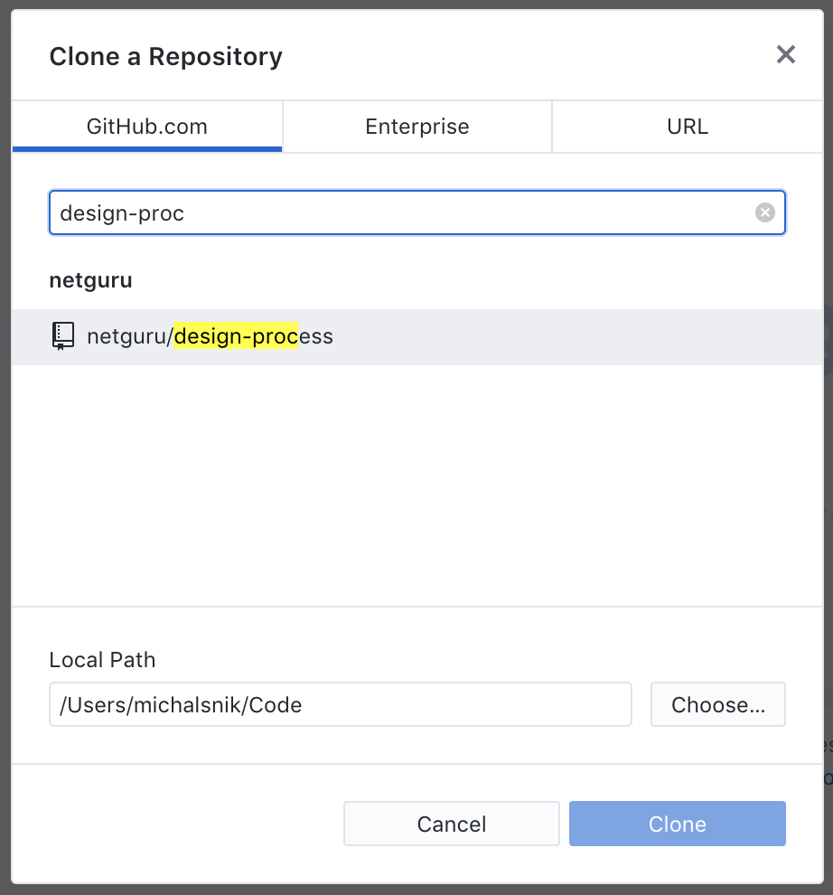
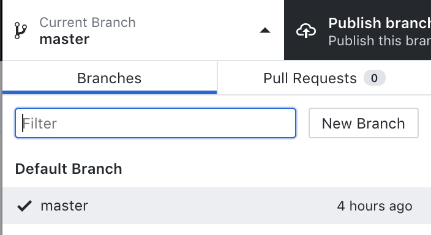
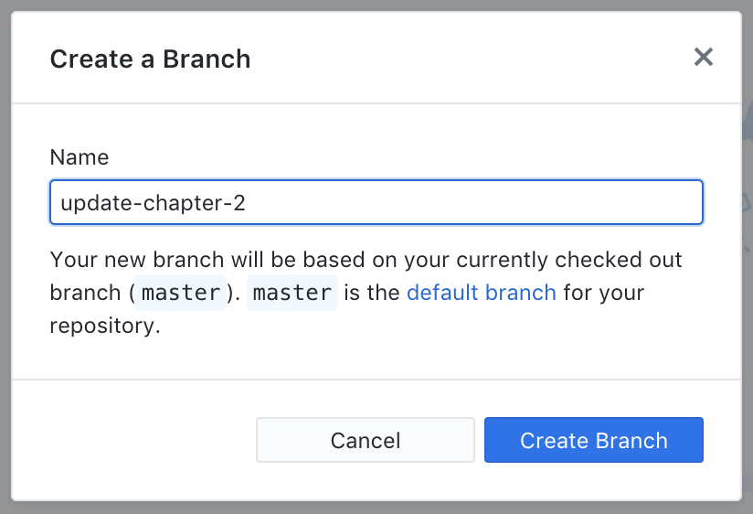
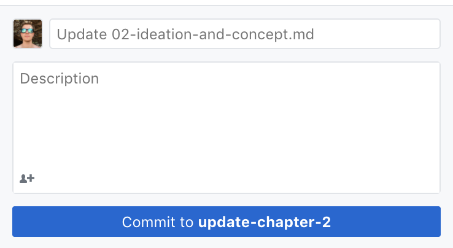

# Design Process - Live Ebook

This repository contains content of [the following ebook](https://design-process.netguru.co).

## How to set it up locally?

1. Clone repository
```
git clone git@github.com:netguru/design-process.git
```

2. Install all dependencies
```
yarn install
```

3. Run local server
```
yarn start
```

Now all your changes should be visible on [localhost](http://localhost:8080).

## How to add content and customize this ebook?

This e-book is built upon [vuepress-theme-live-ebook](https://github.com/netguru/vuepress-theme-live-ebook). Visit its' [documentation](https://github.com/netguru/vuepress-theme-live-ebook) for detailed instruction and tips.

## How to deploy new version?

This e-book uses [Netlify](https://netlify.io/) for CI and deployment.
Anything that goes to master is automatically deployed.

## How to contribute as non-dev person?

You're going to need two tools:
- [Github for Desktop](https://desktop.github.com/)
- Editor of your choice (e.g. [Atom](https://atom.io/), [Sublime](https://www.sublimetext.com/) or [Visual Studio Code](https://code.visualstudio.com/))

If have those installed, make sure you have write access to the repository. You can create ticket [here](https://netguru.atlassian.net/servicedesk/customer/portal/4/group/22/create/94)

1. Open Github App, and find the repository to clone:



2. Click on the current branch, to open branch navigation:



3. Create new branch:



4. Now you can open your editor and edit source files.

5. Once you're done editing, go back to Github App and commit your changes:



6. After your changes are locally commited, you can publish your branch:


7. Since work should be collaborative, now you should create Pull Request on github.

- visit [the repository](https://github.com/netguru/design-process/pulls) and click on `New Pull Request`
- make sure the `base` branch is set to `master`

8. Once your changes are reviewed by one of your collegues, you can `Merge` the Pull Request.

9. Changes merged to `master` branch will be automatically deployed, and should be live in the next 3 minutes.
